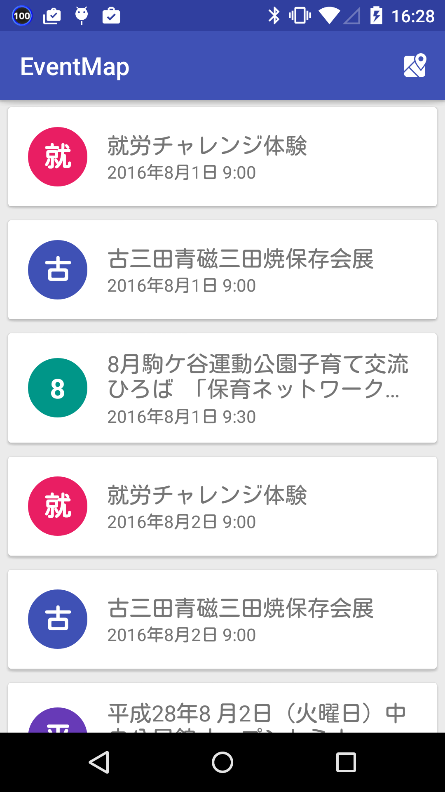
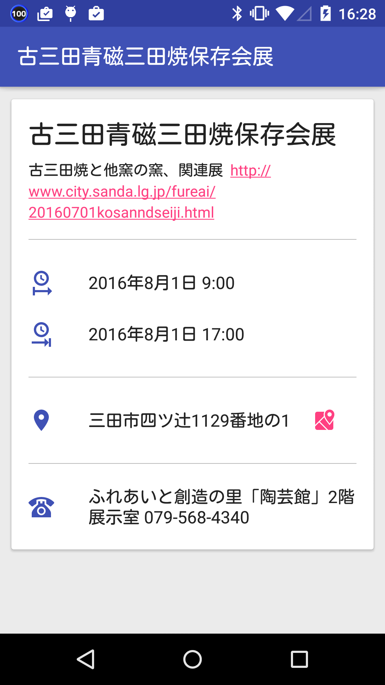
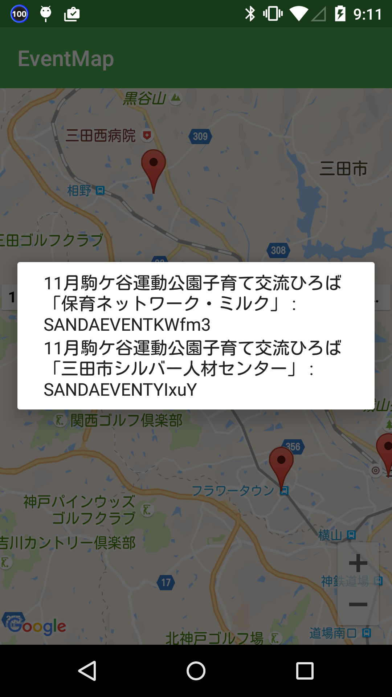
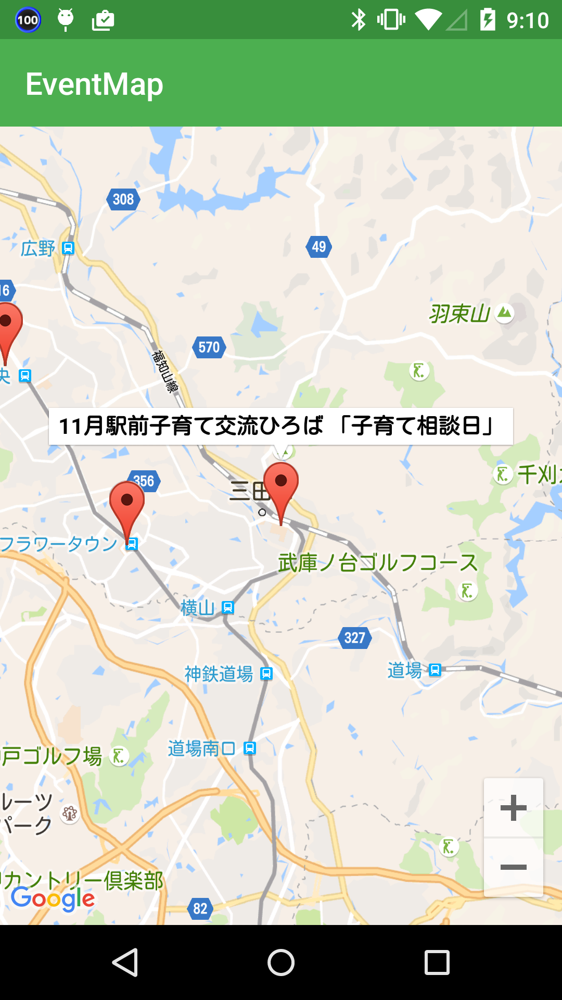

# Code for KOBE イベントカレンダー #

| イベントリスト画面 | イベント詳細画面 | 地図画面1 | 地図画面2 | 
|---|---|---|---|
|  |  |  |  |

## 参考情報 ##

* 後藤さん作成資料
http://www.slideshare.net/masaki52/code-for-kobecocreation

* 三田市イベントカレンダー
http://www.city.sanda.lg.jp/cgi-bin/event_cal/cal_month.cgi?year=2016&month=06
  * URLの引数、`year`と`month`の組み合わせで他の月のイベントページを参照可能。

* 全国地方公共団体コード
http://www.soumu.go.jp/denshijiti/code.html

* 三田市ロゴ

https://commons.wikimedia.org/wiki/File:Symbol_of_Sanda,_Hyogo.svg

  By Kzaral (original raster), Ch1902 and me (Modification of File:Flag of Sanda, Hyogo.svg) [Public domain], via Wikimedia Commons
